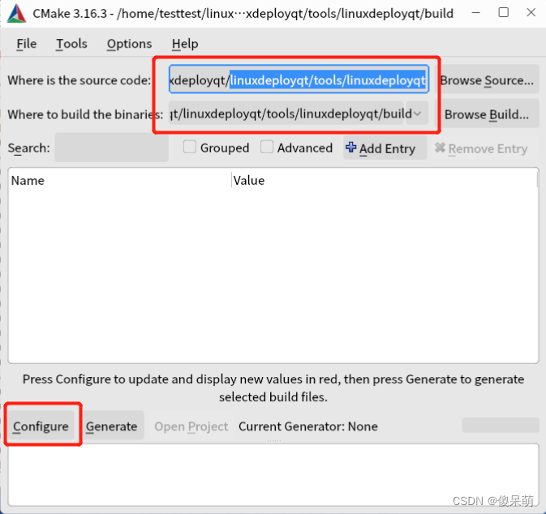

This Code From https://github.com/probonopd/linuxdeployqt.git  version Apr .4.2023  [continuous](https://github.com/probonopd/linuxdeployqt/releases/tag/continuous)

My QT qmake version : QT5.12.3

Use cmake and cmake-gui to configure env for linuxdeployqt:

```sh
sudo apt-get install git g++
sudo apt install patchelf
sudo apt install cmake-gui
```

cd to the tool dir and use cmake-gui to configure QT env

```sh
cd linuxdeployqt/tools/linudeployqt
cmake-gui
```

①.Browse Source->[yourDIr]/linuxdeployqt/tools/linudeployqt

②.Browse Build->[youDir]/linuxdeployqt/tools/linudeployqt/build



③.Configure->Unix Makefiles: Use default native compilers


The env in CMakeList.txt will be shown and may occurs an error msg(so we need configure the env 'Qt5_DIR'):


Then Configure again, it will automatically add an env 'Qt5Core_DIR':


If No error occurs , then click Generate and Makefile will be generated in ./build, we can make then

```sh
cd ./build
make
```

If No error occurs, linuxdeployqt will be generated. cp it to /usr/local/bin and we can use it to release Qt programs.


 
